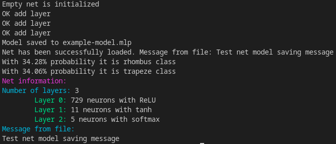

# Описание проекта

Полносвязная нейронная сеть (MLP) для классификации геометрических фигур. 

 Сеть работает с картинками произвольного размера. 
 
 В качестве примера используется обработка сгенерированных изображений размера *27x27* следующих геометрических фигур:
 
- Простая линия 
- Треугольник
- Прямоугольник
- Трапеция
- Пятиугольник
- Круг
- Ромб

> Сгенерировать датасеты можно с помощью запуска программы *dataset-gen*

Главное приложение (*app.exe*) позволяет работать с сетями из консоли (см. *"Использование проекта"*).

<u>Задача сети</u> - отнесение изображения к одному из указанных выше классов (геометрических фигур). 

*Ответом сети* является название класса, к которому относится переданное изображение фигуры, и процент уверенности в полученном результате.

# Структура проекта


<center><b>Схема включений заголовочных файлов</b></center>

### Разделение на уровни


Проект состоит из трёх уровней: *top, mlp и console*. Описание каждого уровня приведено ниже.


|                Уровень                 | <center>Описание</center>                                                                                                                                                                                                                                                                          |                         Файлы                          |
| :------------------------------------: | :------------------------------------------------------------------------------------------------------------------------------------------------------------------------------------------------------------------------------------------------------------------------------------------------- | :----------------------------------------------------: |
|      *Top <br><br>(Архитектуры)*       | Заголовочные файлы, определяющие устройство нейронных сетей и их элементов. <br>Содержит полиморфные классы:<br>1. Нейрон<br>2. Слой<br>3. Нейронная связь<br>4. Функция активации<br>5. Нейронная сеть<br>6. Обработчик файлов моделей <br>и ограничения (concepts) для применяемых типов данных. |                    include/top/*.hh                    |
|  *MLP <br><br>(Реализации)*<br>&nbsp   | Реализация полносвязной нейронной сети и её структурных элементов на основе файлов *top-уровня*.                                                                                                                                                                                                   |            include/mlp\*.hh,<br>src/mlp*.cc            |
| *Console <br> (Пользователя)*<br>&nbsp | Реализация функций управления моделями полносвязных нейронных сетей с помощью текстовых команд                                                                                                                                                                                                     | include/console.hh,<br>src/console.cc, <br>mainfile.cc |


### Нейроны

Классы с обязательным полем *value* произвольного типа, поддерживающего базовые математические операции. Поле содержит текущее значение нейрона. 

> Для каждого нейрона обязан быть определён оператор приведения класса к типу поля value

Нейроны полносвязной сети дополнительно содержат поле **shift**, содержащее значение смещения поля *value*. 

### Слои

Класс слоя не требует наличия каких-либо полей. 
Слой обязан быть итерируемым контейнером, состоящим из нейронов и реализующим метод вычисления размера. 

> Требования к реализации хранения нейронов отсутствуют

Слои полносвязной сети являются надстройкой над *std::vector*, поэтому поддерживают индексацию нейронов.

> Индесация может быть отрицательной. *i-тый* нейрон с конца имеет индекс *-1\*(i+1)*

Метод *apply_offsets* применяет смещение значение каждого нейрона. Вызывается каждый раз после вычисления значений нейронов. 

Метод *neuron_values* используется в случае, если необходимо изменить *только значения* нейронов слоя, а не все поля каждого нейрона.

### Нейронные связи

Класс нейронной связи также не требует начилия каких-либо полей. Нейронная связь обязана быть итерируемым контейнером, позволяющим получить последовательный доступ к каждому весу.

> Нейронная связь содержит веса узлов, связывающих два слоя

Нейронная связь в полносвязной сети представлена надстройкой над *std::vector*, реализующей доступ к вектору чисел как к матрице размера *NxM*, где N и M - размеры входного и выходного слоёв соответственно.

Началом нейронной связи считается весовой коэффициент между первыми нейронами каждого слоя. Далее весовые коэффициенты расположены в порядке возрастания индекса нейрона в выходном слое для каждого индекса нейрона в входном слое.

> Получить вес между *i-тым нейроном* входного слоя и *j-тым* нейроном выходного слоя можно с помощью метода *get_weight( j , i)*

### Функции активации

Группа классов в пространстве имен *activations*. 

Каждая функция активации обязана определять метод применения к слою нейронов.

Так, например, функция ReLU может применяться к отдельному слою нейрона, однако существуют фунции, применяющиеся только к слою в целом (Argmax, Softmax). Следовательно, требование наличия метода применения к слою является более важным.

> Классы функций активаций имеют дружественную функцию *derivative*, вычисляющую производную в точке для любой функции активации с указанной точностью

Каждая функция обязана иметь уникальное имя, доступное с помощью метода *name()*, необходимое для того, чтобы различать обобщённые обьекты функций активации во время загрузки модели из файла или выгрузки в файл.

### Нейронная сеть

Класс, включающий в себя контейнеры слоёв, функций активации и нейронных связей. Обязательно наличие реализации прямого и обратного распространения, метода вычисления размера.

Полносвязная сеть дополнительно включает в себя таблицу слоёв для сборки. Так, при применении метода *add()* слои и активации попадают сначала в данную таблицу. До вызова метода *make()* архитектуру сети можно изменять любым способом. После вызова *make()* произойдёт генерация нейронных связей и заполнение всех контейнеров, сеть будет готова к работе.

> По умолчанию метод *make()* будет выполнен методом прямого или обратного распространения, если таблица слоёв окажется непустой. 
> Используйте *disable_automake()*, чтобы отключить автосборку.

Ответом сети для данного изображения является результат выполнения метода  *feedforward()*. Это кортеж из двух значений типов *size_t* и *neuron_t* - наиболее вероятный класс изображения и процент уверенности соответственно.


### Обработчик моделей. Формат файлов

Класс, управляющий моделями сетей. Обязательно наличие методов загрузки из файла, выгрузки в файл.

Обработчик моделей полносвязной сети реализует формат mlp. Описание файлов данного формата приведено в таблице ниже.

|         Поле          |                                                 Описание                                                 |         Размер (байт)          |
| :-------------------: | :------------------------------------------------------------------------------------------------------: | :----------------------------: |
|   *Сигнатура файла*   |                 Последовательность байт *(MLPFILE)*, <br>определяющая файл формата .mlp                  |               8                |
|  *Количество слоёв*   |                           Неотрицательное число в десятичной системе счисления                           |               8                |
|  *Количество весов*   |                 Неотрицательное число: cумма количеств весов всех нейронных связей сети                  |               8                |
| *Характеристика слоя* |         Два неотрицательных числа: количество нейронов в слое и идентификатор функции активации          | 2 × 8 × L,<br> L - число слоёв |
|    *Значение веса*    |                                         Число с плавающей точкой                                         |   8 × W, <br>W - число весов   |
|  *Значение смещения*  |                      Число с плавающей точкой. <br>Поле *shift* каждого нейрона<br>                      | 8 × N, <br>N - число нейронов  |
| *Конец данных модели* | Последовательность байт, <br>определяющая конец модели. <br>Используется для контроля целостности модели |               8                |
|      *Сообщение*      |                Произвольная последовательность байт. <br>Обрабатывается как UTF-8 строка                 |         8×R, <br>R ≥ 0         |

> Используйте метод *show_model_info()*, чтобы получить информацию о любой сети

### Глобальные переменные

В каждой программе существует глобальная таблица функций активации *activations::table*, позволяющая получить указатель на любую реализованную функцию активации.

Необходимо это для того, чтобы существовал хотя бы один объект каждого класса функций активации. В противном случае создать нейронную сеть на основе модели из файла, не зная заранее используемых активаций, не получится.

> Доступные функции активации указываются в файле *activations_table.cc*


### Расширения файлов
| Расширение |                                Описание                                 |
| :--------: | :---------------------------------------------------------------------: |
|   *mlp*    |             Модели MLP-сетей. <br>Обработчик: MLPModelSaver             |
|   *mlps*   | Скрипты для нейронной сети <br>Обработчик: process_script (mainfile.cc) |
|    *lb*    |      Метки изображений. <br>Метка определяет ожидаемый ответ сети       |
|   *lnm*    |         Карта имён меток. <br>Каждой метке задано текстовое имя         |


# Использование проекта


## Разработка кода с MLP библиотекой

Заголовочный файл *mlp.hh* содержит все необходимые для работы с полносвязными сетями классы.

Создайте обьект класса NetMLP и добавьте нужное количество слоев с указанием размера и функции активации. Для получения функции активации используется как создание обьекта нужной функции, так и получение из глобальной таблицы по имени.

Далее используйте *make()*, чтобы собрать сконфирурированную сеть. Если автосборка разрешена, данный шаг не требуется.

> По умолчанию автосборка разрешена. Сборка сети происходит всегда, когда таблица слоёв непустая. Используйте метод *disable_automake()*, чтобы отключить. 

Сеть готова к работе. Метод *feedforward(arg)* реализует прямое распространение и принимает входной вектор-изображение.

> Размер вектора изображения обязан совпадать с размером первого слоя сети, иначе часть нейронов будет незаполнена или изображение не загрузится полностью. Чтобы избежать ошибки, производится проверка данного требования

 Для обновления весов используйте метод *bacprop(arg)*.

**Пример кода:**
```
#include <iostream>
#include "mlp.hh"
using namespace activations;
int main()
{
    NetMLP net;
    
    size_t input_size{27 * 27};
    
    // Настраиваем сеть
    net.add(input_size, table.get_by_name("sigmoid"));
    net.add(15, table.get_by_name("ReLU"));
    net.add(15, table.get_by_name("tanh"));
    net.add(5, table.get_by_name("softmax"));

    // net.make();  /*  По умолчанию не требуется   */
    
    std::vector<neuron_t> target(input_size);
    
    // Ваш метод загрузки и препроцессинга изображения
    //  target = get_image();  
    
    auto result = net.feedforward(target);
    
    // Выводит номер класса с наибольшим результатом
    // и результат (процент) уверенности
    std::cout << std::get<size_t>(result) << " " << std::get<neuron_t>(result);
    
    return 0;
}

```


Для работы с моделями сетей используйте MLPModelSaver. Методы *save_net_to_file(net, fpath, msg)* и *upload_net_from_file(fpath)* позволяют сохранить и загрузить сеть соответственно. Для вывода информации о сети вызывайте метод *show_model_info(net)*

> Сеть можно сохранить с дополнительным текстовым сообщением

**Пример кода:**
```
#include <iostream>
#include "mlp.hh"
using namespace activations;
int main()
{
    MLPModelSaver mds;
    auto loaded = mds.upload_net_from_file("model.mlp");
    
    NetMLP net = std::get<NetMLP>(loaded); 
    std::string message = std::get<std::string>(loaded);
    
    mds.show_model_info(net);
    
    return 0;
}

```
## Взаимодействие с консолью

Запустите исполняемый файл **app** программы. После появления приглашения ко вводу используйте указанные ниже команды. 

> Одна строка может содержать только одну команду

### Команды

| Название  |               Действие                |                     Аргументы                      |
| :-------: | :-----------------------------------: | :------------------------------------------------: |
|   *new*   |        Создаёт новую MLP-сеть         |                         -                          |
|  *save*   |         Сохраняет сеть в файл         |                Имя файла, сообщение                |
|  *load*   |        Загружает сеть с файла         |                Путь к файлу модели                 |
|  *info*   |       Выводит информацию о сети       |                         -                          |
|   *add*   |         Добавляет слой в сеть         |             Число нейронов, активация              |
|  *make*   |             Собирает сеть             |                         -                          |
|  *train*  |             Обучает сеть              |             Папка обучающего датасета              |
|  *test*   |            Тестирует сеть             |            Папка тестирующего датасета             |
| *predict* | Предсказание сети <br>для изображения | Название изображения,<br>папка с картой имён меток |


**Пример работы:**


### Создание скриптов

Скрипт представляет собой последовательность команд, записанных в mlps-файле. 

> Запустите программу с ключом -S и передайте путь к файлу скриптов

**Пример скрипта:**

*example.mlps*
```
new
add 729 ReLU
add 11 tanh
add 5 softmax
make
save example-model.mlp Test net model saving message
load example-model.mlp
predict ../src/dataset/train/shape_3_triangle.png ../src/dataset/
predict ../src/dataset/train/shape_6_circle.png ../src/dataset/
info
exit

```

>В примере создаётся нейросеть с тремя слоями. 
>Входной слой предназначен для загрузки изображения 27x27
>Выходной слой состоит из пяти нейронов, следовательно, сеть различает 5 классов изображений
>Папка ./src/dataset/ содержит карту названий меток

*Результат работы скрипта:*

